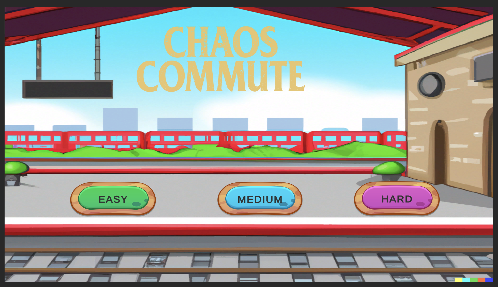
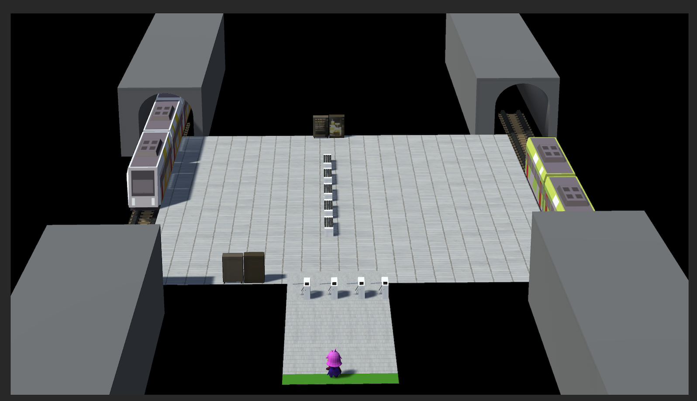

<!-- PROJECT LOGO -->
 

  

    
  

<h3 align="center">Commuter Chaos : DJV Project</h3>

<!-- ABOUT THE PROJECT -->

## About The Project
The project's goal is to use the techniques learned during the semester to create a mini-video game. 

In Commuter Chaos, you play as a RATP (Parisian public transportation) controller and your objective is to check tickets of passengers without valid tickets. 

The game has multiple levels that become progressively more difficult as you progress.
## Controls 

The controller is moved using the right mouse click. 
A ticket check is performed with the left mouse click. 

If necessary, you can move the camera by moving the mouse to the edge of the screen.
## Built With

* [Unity](https://unity.com/fr)
* [Blender](https://www.blender.org/)
* [Sketchup](https://www.sketchup.com/fr)

## Screenshots

